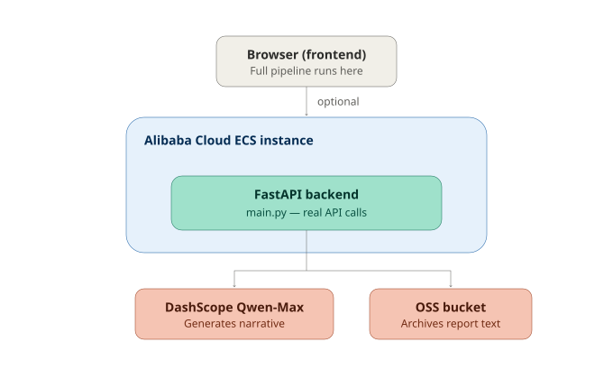

# DataPilot Agent - Autonomous Data Analyst

[](LICENSE)
[](https://www.alibabacloud.com)
[](https://developer.mozilla.org/en-US/docs/Web/HTML)
[](https://developer.mozilla.org/en-US/docs/Web/JavaScript)
[](https://developer.mozilla.org/en-US/docs/Web/CSS)

## 🏆 Hackathon Track
**Track 4: Autopilot Agent** — *"An autonomous data analyst that ingests datasets, identifies patterns, generates visualizations, and writes reports."*

---

## 🎯 Overview

DataPilot Agent is an autonomous data-analyst agent that takes a raw CSV dataset and, without any human input mid-flow, runs it through every stage of analysis end to end:

**Ingest → Profile → Detect Patterns → Verify → Visualize → Report**

The distinguishing feature is the **verification-and-self-heal loop**: after generating findings, the agent independently recomputes its own key statistic and checks it against what it produced. If the two disagree, it doesn't stop and wait for a person — it re-runs the affected stage itself, logs what it did in the Autonomy Log, and only escalates to a human if it exhausts its retry budget. This is the core difference between an *autopilot* agent and a workflow that merely pauses for approval.

Built entirely with **HTML, CSS, and JavaScript** — no build step, no backend required, runs by opening `index.html`. The frontend simulates integration with Alibaba Cloud services (Qwen AI / DashScope for the narrative report, RDS for profile storage, OSS for report archival, ECS for job execution).

---

## ✨ Key Features

| Feature | Description |
|---------|-------------|
| 🔄 **Fully Autonomous Pipeline** | Six stages run back-to-back with no human checkpoint required to proceed |
| 🛠️ **Self-Healing Ingestion** | Detects malformed rows and bad values, auto-repairs them, and logs every decision |
| 🧠 **Pattern Detection** | Computes trends (linear regression), correlations (Pearson), and anomalies (z-score) |
| ✅ **Self-Verification** | Independently recomputes its own headline statistic and re-runs the stage if it disagrees with itself |
| 📊 **Auto-Generated Visualizations** | Inline SVG trend, distribution, and correlation charts, no charting library needed |
| 📝 **Narrative Report Writer** | Assembles a plain-English report of findings, fixes made, and recommendations |
| ⚠️ **Escalation as Last Resort** | Only surfaces to a human if self-healing itself fails repeatedly |
| ☁️ **Alibaba Cloud Integration** | Simulated integration with Qwen AI, RDS, Redis-adjacent caching, and OSS |

---

## 🚀 Quick Start

### No Installation Required

1. **Clone the repository:**
   ```bash
   git clone https://github.com/Ivy1-0/intelliflow-agent.git
   ```
2. Open `index.html` in a browser.
3. Pick a sample dataset (or paste your own CSV) and click **Run Autopilot**.
4. Click **Run With Injected Fault** to watch the agent deliberately encounter a bad verification result and self-heal without any human clicking anything.

---

## 🧭 Why This Fits Track 4

Track 4 asks for an agent that autonomously completes a multi-step workflow start to finish, with the explicit example of *"an autonomous data analyst that ingests datasets, identifies patterns, generates visualizations, and writes reports."* DataPilot Agent implements exactly that pipeline, and adds the self-correction loop (detect → retry → verify again) that separates an autopilot agent from a single-step classifier with a human approval gate.

---

## 🏗️ Architecture



The frontend runs the full pipeline entirely client-side for the zero-install demo. The `backend/` service is the real Alibaba Cloud integration layer — it makes genuine calls to DashScope (Qwen-Max) for report generation and to OSS for archival. See [`backend/main.py`](backend/main.py) and [`DEPLOY.md`](DEPLOY.md) for how it's deployed and verified on Alibaba Cloud ECS.

## 📄 Submission details

See [`SUBMISSION.md`](SUBMISSION.md) for the full feature/functionality writeup used in the hackathon submission form.
